# 🔧 Environment Variables Guide

## Overview
This guide explains all environment variables needed for the SP1 project template, clarifying what's required vs optional.

## Required Configuration

### 1. SP1_PROVER
```bash
SP1_PROVER=network
```
- **Purpose**: Tell SP1 to use network proving
- **Required**: Yes - for network-based proof generation
- **Alternative**: `local` (for local proving, not recommended)

### 2. NETWORK_PRIVATE_KEY
```bash
NETWORK_PRIVATE_KEY=0x1234567890abcdef...
```
- **Purpose**: Authenticate with SP1 Prover Network (NOT Ethereum!)
- **Required**: Yes - cannot use network proving without this
- **How to get**: Generate at https://network.succinct.xyz
- **Important**: This is for Succinct's internal network, not Ethereum
- **Needs**: SP1 network credits (not ETH)

### 3. PRIVATE_KEY
```bash
PRIVATE_KEY=0xabcdef1234567890...
```
- **Purpose**: Deploy smart contracts to Ethereum blockchain
- **Required**: Yes - cannot deploy contracts without this
- **How to get**: Use MetaMask or `cast wallet new`
- **Important**: This is for Ethereum transactions (the one you already have!)
- **Needs**: Sepolia ETH for gas fees

### 4. RPC_URL
```bash
RPC_URL=https://rpc.sepolia.succinct.xyz
```
- **Purpose**: Connect to Ethereum network for contract deployment
- **Required**: Yes - cannot deploy without RPC connection
- **Recommended**: Succinct's RPC (no API key needed)
- **Alternatives**: Infura, Alchemy, public RPC

## Optional Configuration

### 1. ETHERSCAN_API_KEY ⚠️ OPTIONAL
```bash
ETHERSCAN_API_KEY=your_etherscan_api_key
```
- **Purpose**: Verify contract source code on Etherscan
- **Required**: **NO** - contracts work perfectly without this
- **Benefits**: Makes contracts readable/auditable on Etherscan
- **How to get**: https://etherscan.io/apis
- **Without this**: Contracts deploy and work normally, just not verified

### 2. NETWORK
```bash
NETWORK=sepolia
```
- **Purpose**: Select deployment network
- **Required**: No - defaults to sepolia
- **Options**: sepolia, mainnet, base, arbitrum

## Auto-Generated Variables

These are filled automatically by the setup scripts:

```bash
FIBONACCI_PROGRAM_VKEY=0x...  # Generated by `cargo run --bin vkey`
FIBONACCI_CONTRACT_ADDRESS=0x...  # Generated after deployment
```

## Quick Setup Example

**Minimum required .env file:**
```bash
# Required only
SP1_PROVER=network
NETWORK_PRIVATE_KEY=0x1234567890abcdef...
PRIVATE_KEY=0xabcdef1234567890...
RPC_URL=https://rpc.sepolia.succinct.xyz
```

**Complete .env file:**
```bash
# Required
SP1_PROVER=network
NETWORK_PRIVATE_KEY=0x1234567890abcdef...
PRIVATE_KEY=0xabcdef1234567890...
RPC_URL=https://rpc.sepolia.succinct.xyz

# Optional
ETHERSCAN_API_KEY=your_etherscan_api_key
NETWORK=sepolia

# Auto-generated
FIBONACCI_PROGRAM_VKEY=
FIBONACCI_CONTRACT_ADDRESS=
```

## Common Misunderstandings

### ❌ "I need Infura/Alchemy API key"
**Reality**: No! Use Succinct's RPC: `https://rpc.sepolia.succinct.xyz`

### ❌ "I must have Etherscan API key"
**Reality**: No! It's optional. Contracts work without verification.

### ❌ "RPC and Etherscan API are the same thing"
**Reality**: Completely different:
- **RPC**: Deploy contracts (required)
- **Etherscan API**: Verify contracts (optional)

### ❌ "Why do I need 2 private keys? I already have one with Sepolia ETH"
**Reality**: They serve completely different purposes:

**NETWORK_PRIVATE_KEY**:
- **For**: SP1 Prover Network (Succinct's internal system)
- **Purpose**: Pay for proof generation, authenticate with Succinct
- **Blockchain**: NOT Ethereum! Internal SP1 network
- **Needs**: SP1 network credits (not ETH)
- **Must be**: Whitelisted by Succinct

**PRIVATE_KEY**:
- **For**: Ethereum blockchain (Sepolia/Mainnet)
- **Purpose**: Deploy contracts, send transactions
- **Blockchain**: Ethereum Sepolia/Mainnet
- **Needs**: Sepolia ETH for gas fees
- **This is**: The one you already have!

### ❌ "Can I use the same private key for both?"
**Reality**: Technically possible but NOT recommended:
- Security risk: Using same key for different systems
- Different purposes: One for SP1 network, one for Ethereum
- Different requirements: One needs SP1 credits, one needs ETH

## System Architecture Overview

Here's how the two private keys work in different systems:

```mermaid
graph TD
    A["👤 You"] --> B["💰 Private Key with Sepolia ETH"]
    A --> C["🔑 SP1 Network Private Key"]
    
    B --> D["🌐 Ethereum Sepolia Network"]
    C --> E["🚀 SP1 Prover Network"]
    
    D --> F["📝 Deploy Smart Contracts"]
    D --> G["💸 Pay Gas Fees"]
    D --> H["🔗 Blockchain Transactions"]
    
    E --> I["🧮 Generate Proofs"]
    E --> J["💳 Pay Proof Credits"]
    E --> K["🔐 Network Authentication"]
    
    F --> L["✅ Contract Deployed"]
    I --> M["📋 Proof Generated"]
    M --> N["🔍 Verify On-Chain"]
```



## Real-World Example

**When you run the project:**

1. **SP1 Network Private Key** is used:
   ```bash
   # This uses NETWORK_PRIVATE_KEY internally
   cargo run --bin network_evm  # Generate proof via SP1 network
   ```

2. **Ethereum Private Key** is used:
   ```bash
   # This uses PRIVATE_KEY internally
   forge script Deploy.s.sol --rpc-url $RPC_URL --private-key $PRIVATE_KEY --broadcast
   ```

**Flow:**
1. Use `NETWORK_PRIVATE_KEY` → Generate proof on SP1 network
2. Use `PRIVATE_KEY` → Deploy contract to Ethereum
3. Use `PRIVATE_KEY` → Verify proof on-chain

## Testing Your Setup

```bash
# Test RPC connection
curl -X POST -H "Content-Type: application/json" \
  --data '{"jsonrpc":"2.0","method":"eth_blockNumber","params":[],"id":1}' \
  https://rpc.sepolia.succinct.xyz

# Test Ethereum address has funds
cast balance YOUR_ADDRESS --rpc-url https://rpc.sepolia.succinct.xyz
```

## Next Steps

1. Create `.env` file with required variables
2. Run `cargo run --bin vkey` to generate verification key
3. Deploy contracts with `forge script`
4. (Optional) Verify contracts on Etherscan

For detailed setup instructions, see [ON_CHAIN_SETUP.md](ON_CHAIN_SETUP.md). 